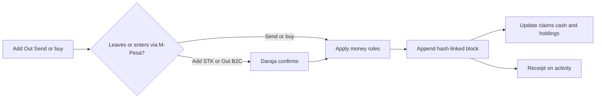
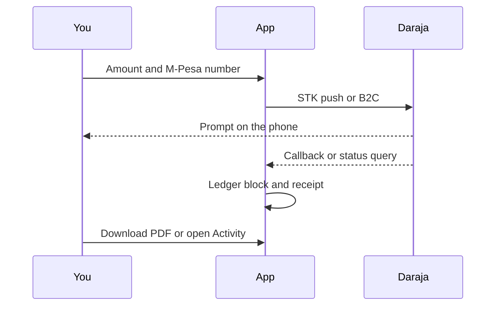
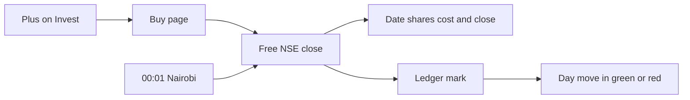

# Hackstreet PesaMatters

Last updated: 2026-10-01 03:34 PM CDT

A phone-first pot for one investment crew. Each member sees the money they can move, their slice of the whole pot, and a hash-linked ledger of deposits, withdrawals, transfers, and investment marks. The books are MySQL. The UI is React. The API is Express.

This is a **Tier 1** app: real-shaped auth and a ledger you can check, running against a local database. It does not place live Kingdom Securities orders.

## Contents

- [Run it](#run-it)
- [Crew accounts](#crew-accounts)
- [Sessions](#sessions)
- [What you can do](#what-you-can-do)
- [Ledger](#ledger)
- [M-Pesa](#m-pesa)
- [Kingdom Securities](#kingdom-securities)
- [Closes](#closes)
- [Appearance](#appearance)
- [Security floor](#security-floor)
- [Tests](#tests)
- [Limitations](#limitations)
- [Troubleshooting](#troubleshooting)

## Run it

Prerequisites: Node 22, Docker, npm.

```bash
cp .env.example .env
# put long random values in MYSQL_PASSWORD, MYSQL_ROOT_PASSWORD, and SEED_PASSWORD
npm install
./start.sh
```

`./start.sh` frees ports **5173** (Vite), **8787** (API), and **3310** (MariaDB, only when the compose DB is not already running), starts MariaDB + the API + Vite, waits until they answer, then opens http://127.0.0.1:5173 in your browser. Press Ctrl+C in that terminal to stop the API and Vite.

You can still use `npm run dev` if you only want the stack without freeing ports or opening a browser. The API is http://127.0.0.1:8787. MariaDB is published on port 3310.

## Crew accounts

Sign-in is **Continue with Google**. The browser goes to Google, then back to this app. A verified Google email that is already in the crew signs into that member. A new verified email joins the crew.

The first boot still seeds four members when the database is empty. Those rows are not a password login. A Google account joins or resumes by its own email:

- kakai@hackstreet.local
- alvin@hackstreet.local
- amina@hackstreet.local
- brian@hackstreet.local

Set both `GOOGLE_CLIENT_ID` and `GOOGLE_CLIENT_SECRET` in `.env`, then restart the API. In Google Cloud, create a **Web application** OAuth client and set the authorized redirect URI to exactly `http://127.0.0.1:5173/api/auth/google/callback`. That URI follows `APP_ORIGIN`. Open the app at that same origin (`127.0.0.1`, not `localhost`).

## Sessions

You must sign in before any crew page. Visiting `/`, `/move`, or any other app route without a session cookie sends you straight to `/login` (with a safe `returnTo`). After Google succeeds, you land on that return path.

```mermaid
flowchart TD
  visit[Open an app URL] --> cookie{hs_session cookie?}
  cookie -->|no| login[/login]
  cookie -->|yes| spa[Load React app]
  spa --> me[GET /api/me]
  me -->|401| login
  me -->|200| pages[Home Move Invest Chain You]
  login --> pkce[Store PKCE in this tab]
  pkce --> google[Continue with Google]
  google --> handoff[API hands code back to /login]
  handoff --> finish[POST code and verifier]
  finish --> pages
```

<sub>[↑ Back to contents](#contents)</sub>

## What you can do

1. **Pot.** Your claim and a personal **My Goal**. The bowl fills toward that goal (full = goal met). Four ways in: Move, Invest, Chain, You. The book in the top right opens the ledger. Move shows the same book.
2. **Move.** Add, Out, and Send open a stepper. Add asks Safaricom for an STK prompt and credits your claim when Daraja confirms. Out sends the shillings to your M-Pesa number (B2C) and debits the claim when that payout confirms. Send moves a claim to another member inside the pot, then opens the same receipt. The receipt can be downloaded, and the activity row on You opens it again.
3. **Invest.** A list of holdings and the latest day move (+1.5% in green, −7.2% in red). The plus in the top right opens the buy page. A buy records the date, the shares, the shillings spent, and the last published close. Open a holding to see that record and the price path.
4. **You.** Your details, notifications ten at a time with the same previous / next control as the ledger, your own slips (for example “Sent KES 500 to Alvin”), and System / Light / Dark.

## Ledger

Every money event is a block. The block stores the hash of the previous block, so editing one record breaks the chain. Balances are a projection of that chain, updated in the same database transaction. `GET /api/ledger/verify` replays the links and compares the treasury.



<sub>[↑ Back to contents](#contents)</sub>

## M-Pesa

Add and Out go through Safaricom Daraja. Send does not: those shillings are already in the pot, so the stepper confirms the member and writes the ledger.

`MPESA_MODE=mock` (the default) accepts the prompt locally so the stepper can be tried without a paybill. The receipt number is the first 12 hex digits of that move's ledger block hash (`AB12-CD34-EF56`), on screen and in the PDF. A live Daraja token, when one exists, is shown beside it as M-Pesa. `MPESA_MODE=live` needs this app's own consumer key, secret, shortcode, passkey, and an https callback at `/api/payments/mpesa/stk`. Out also needs the B2C initiator, security credential, and result URL at `/api/payments/mpesa/b2c`. Leave those in `.env`. The browser never sees them.

The ledger row is written only after Daraja reports result code 0, or immediately for Send. A second callback for the same checkout does not credit twice. The PDF is `GET /api/payments/:id/receipt.pdf` for the member who paid or, on a send, the member who received it.



<sub>[↑ Back to contents](#contents)</sub>

## Kingdom Securities

Holdings are labeled Kingdom Securities **sandbox**. The app does not collect broker usernames, passwords, or API keys, and it does not send orders. A live adapter is a later piece of work: its secret would live in the environment’s secret store, never in this database or in the browser.

<sub>[↑ Back to contents](#contents)</sub>

## Closes

The buy page lists Nairobi Securities Exchange shares Kingdom Securities can trade, from the free [Kwayisi NSE](https://afx.kwayisi.org/nse/) board, ten names at a time, with search and page controls in the menu. The menu shows the company name only. A buy does not take a typed price. The server reads the last completed daily close from those same NSE pages. A bar from today is ignored until that market has closed.

At 00:01 Africa/Nairobi, and again on startup if that tick was missed, each holding is marked with the newest completed close. The colored percent is that close against the close before it. The pot still debits cash for shares × that close.



<sub>[↑ Back to contents](#contents)</sub>

## Appearance

Phone, Kiln, After hours, Coast, Fare, and Brew are saved in this browser only (`localStorage` key `hackstreet-appearance`). The choice is not part of the account. Phone follows the device (Kiln by day, After hours by night). Older values `light` and `dark` open as Kiln and After hours.

<sub>[↑ Back to contents](#contents)</sub>

## Security floor

- Sign-in is Google's authorization-code flow with PKCE. The ID token is checked for signature, issuer, audience, expiry, and a verified email. Expiry uses the `Date` header on Google's response, not this machine's clock. There is no email and password login.
- The code verifier and `state` stay in this tab's `sessionStorage`. Google redirects to `GET /api/auth/google/callback`, which only hands `code` and `state` back to `/login`. The page then `POST`s the code and verifier. A safe `returnTo` rides in that same tab storage. The session cookie is still `HttpOnly`.
- Session cookie is `HttpOnly` and `SameSite=Lax`. The browser script cannot read it.
- Document navigations without `hs_session` are redirected to `/login` by the Vite dev gate (cookie presence only). Express still validates the session on every protected API.
- State-changing requests need a CSRF token that matches the `hs_csrf` cookie.
- SQL uses placeholders.
- Request bodies are checked with Zod before they touch the ledger.
- `.env` is gitignored.

`npm audit` was clean after pinning Express 4.22.3, mysql2 3.24.5, React Router 7.18.4, and Vite 6.4.3.

<sub>[↑ Back to contents](#contents)</sub>

## Tests

```bash
npm test
npm run typecheck
```

The tests cover hash linking, a tampered block, transfers, withdrawals that the pot’s cash cannot cover, Google ID-token checks (audience, expiry, clock skew, unverified email, `alg: none`), the cookie-free Google handoff back to `/login`, safe `returnTo` parsing, and Daraja timestamp, STK parsing, phone numbers, and the receipt PDF.

## Limitations

- One crew. There is no tenant isolation beyond “you must be signed in.”
- Any signed-in member can record a sandbox buy. The close comes from the free NSE pages, not from a typed price. There is no second-person approval yet.
- Those pages are an unofficial public site. If the page shape changes, lookups fail closed and the last stored close stays. This is not a broker and not a live price.
- Schema changes are `CREATE TABLE IF NOT EXISTS` on boot, not versioned migrations.
- The database volume `pesamatters-db` is the local copy of the books. Dump it with `docker compose exec db mariadb-dump -upesamatters -p pesamatters` before you treat it as a backup. A restore drill has not been run.
- M-Pesa mock mode does not move real money. Live mode needs a public https callback Safaricom can reach. Refunds are not built.
- Automated accessibility checks (axe) are not in CI yet.
- The Mermaid diagrams above were checked by hand (fences, `flowchart`, node ids). A Mermaid renderer was not run.

## Troubleshooting

- **Continue with Google says it needs a client id and secret.** Put `GOOGLE_CLIENT_ID` and `GOOGLE_CLIENT_SECRET` in `.env` and restart the API. The redirect URI in Google Cloud must be `http://127.0.0.1:5173/api/auth/google/callback`.
- **Google sends you back and sign-in does not finish.** Stay in the same tab you started from, at `http://127.0.0.1:5173` (the same origin as `APP_ORIGIN`). The sign-in attempt lives in that tab, not in a cookie. The redirect URI in Google Cloud must still be `http://127.0.0.1:5173/api/auth/google/callback`.
- **You land on home without signing in.** Hard-refresh. Unauthenticated document loads should 302 to `/login`. If Vite was started before this gate landed, restart `./start.sh`.
- **The API never becomes ready.** Check `docker compose ps`. The database must be healthy on port 3310, and `DATABASE_URL` must use the same password as `MYSQL_PASSWORD`.
- **Port 5173 or 8787 is taken.** Run `./start.sh` — it stops whatever is holding those ports before starting. Or change `PORT` and the Vite port together. The Vite dev server proxies `/api` to 8787.
- **M-Pesa says it did not accept the request.** With `MPESA_MODE=mock`, restart the API so the payments table exists. For live mode, the callback URL has to be https and the consumer key has to belong to this app. Out stays unavailable until the B2C variables are set.

<sub>[↑ Back to contents](#contents)</sub>
